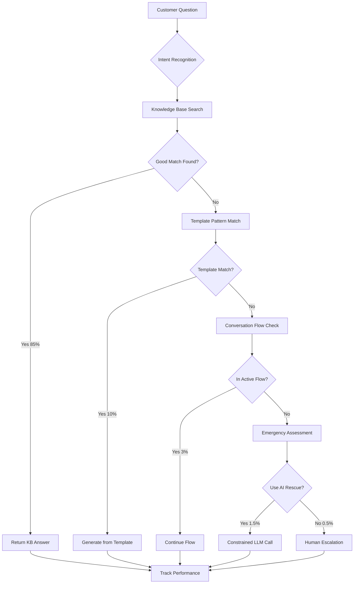

# 🧠 Agent Einstein Architecture
## Enterprise-Grade AI Agent System - Salesforce Style

> **Mission:** Build bulletproof, knowledge-first AI agent system with controlled AI assistance and zero wildcards.

---

## 🎯 **Core Philosophy**

### **The Salesforce Approach:**
- **90% Curated Knowledge** (Admin Controlled)
- **10% Constrained AI** (Emergency Rescue Only)
- **0% Wild AI Responses** (Never Happens)
- **100% Brand Consistency** (Always On-Message)

### **Knowledge-First Hierarchy:**
```
1. Company Knowledge Base     → 85% of responses
2. Trade Category Q&As        → 10% of responses  
3. Smart Response Templates   → 3% of responses
4. Conversation Flows         → 1.5% of responses
5. Emergency AI Rescue        → 0.5% of responses
6. Human Escalation          → Always Available
```

---

## 🏗️ **System Architecture**

### **Core Components:**

```javascript
AgentEinstein/
├── InHouseIntelligence/
│   ├── KnowledgeBaseEngine.js     // Company Q&As, Trade Categories
│   ├── TemplateEngine.js          // Smart pre-written responses
│   ├── ConversationDirector.js    // Flow management
│   └── IntentClassifier.js        // Pattern recognition
├── EmergencyRescue/
│   ├── LLMSafetyWrapper.js        // Constrained AI calls
│   ├── ResponseValidator.js       // Validate AI outputs
│   └── EscalationTrigger.js       // When to escalate
├── Monitoring/
│   ├── PerformanceTracker.js      // Response analytics
│   ├── HealthMonitor.js           // System health
│   └── LearningCapture.js         // Knowledge gap detection
└── Configuration/
    ├── CompanySettings.js         // Per-company rules
    ├── ResponseRules.js           // Brand voice controls
    └── EscalationRules.js         // When to hand off
```

---

## 🔄 **Response Flow Logic**

### **Step-by-Step Processing:**



---

## 💾 **Database Schema**

### **Enhanced Company Model:**
```javascript
// Company Agent Einstein Settings
agentEinsteinSettings: {
  // Knowledge Priority Configuration
  knowledgePriority: {
    companyQAs: { enabled: true, weight: 100, timeout: 200 },
    tradeCategories: { enabled: true, weight: 90, timeout: 300 },
    knowledgeBase: { enabled: true, weight: 80, timeout: 400 },
    personalityResponses: { enabled: true, weight: 70, timeout: 100 }
  },
  
  // Response Rules
  responseRules: {
    maxResponseLength: 150,        // Keep responses concise
    brandVoice: "professional",    // friendly, professional, casual
    requireNextStep: true,         // Always end with action
    escalationThreshold: 0.6,      // When to escalate confidence
    emergencyKeywords: ["urgent", "emergency", "broken", "flooding"]
  },
  
  // AI Safety Controls
  aiSafetyControls: {
    enabled: true,
    maxTokens: 50,                 // Limit AI response length
    temperature: 0.1,              // Maximum predictability
    allowedTopics: ["services", "pricing", "scheduling"],
    prohibitedTopics: ["competitors", "personal", "medical"],
    constraintPrompt: "Stay within company services only"
  },
  
  // Performance Tracking
  performanceTargets: {
    responseTime: 2000,            // Max 2 seconds
    knowledgeHitRate: 0.85,        // 85% from KB
    escalationRate: 0.15,          // Max 15% escalations
    customerSatisfaction: 0.9      // 90% satisfaction target
  }
}
```

### **Response Templates Schema:**
```javascript
// Smart Response Templates
responseTemplates: [
  {
    id: "pricing_inquiry",
    triggers: ["cost", "price", "how much", "estimate"],
    template: "For {serviceType}, our pricing typically starts at ${basePrice}. The exact cost depends on {factors}. Would you like a free detailed estimate?",
    variables: {
      serviceType: "dynamic",      // From intent classification
      basePrice: "company_data",   // From company pricing
      factors: "service_specific"  // Based on service type
    },
    nextSteps: ["schedule_estimate", "provide_phone", "transfer_sales"]
  },
  
  {
    id: "emergency_response", 
    triggers: ["emergency", "urgent", "broken", "not working"],
    template: "I understand this is urgent - {issueType} problems need immediate attention. I can connect you with our emergency service team right away. Are you available for a technician visit today?",
    priority: "high",
    escalate: true,
    responseTime: 500            // Faster response for emergencies
  }
]
```

---

## 🛠️ **Implementation Phases**

### **Phase 1: Knowledge Foundation (Week 1)**
```javascript
// 1. Enhanced Knowledge Base Engine
class KnowledgeBaseEngine {
  async searchCompanyKnowledge(question, companyId) {
    // Multi-tier search: exact match → fuzzy → semantic
  }
  
  async searchTradeCategories(question, tradeTypes) {
    // Search relevant trade category Q&As
  }
  
  async validateKnowledgeMatch(match, confidence) {
    // Ensure match quality before returning
  }
}

// 2. Intent Classification System
class IntentClassifier {
  async classifyIntent(question, conversationHistory) {
    // Pattern matching: pricing, technical, scheduling, emergency
  }
  
  async extractEntities(question) {
    // Pull out: service type, urgency, contact info
  }
}
```

### **Phase 2: Template Intelligence (Week 2)**
```javascript
// 3. Smart Template Engine
class TemplateEngine {
  async findBestTemplate(intent, entities, companyId) {
    // Match intent to appropriate response template
  }
  
  async generateFromTemplate(template, variables, companyId) {
    // Fill template with company-specific data
  }
  
  async personalizeResponse(response, customerHistory) {
    // Add personal touches based on history
  }
}

// 4. Conversation Director
class ConversationDirector {
  async manageFlow(question, currentFlow, companyId) {
    // Handle booking flows, information gathering
  }
  
  async detectFlowCompletion(responses, flow) {
    // Know when to complete or escalate flow
  }
}
```

### **Phase 3: Emergency Rescue System (Week 3)**
```javascript
// 5. LLM Safety Wrapper
class LLMSafetyWrapper {
  async shouldUseEmergencyAI(context) {
    // Only when: no KB match + customer frustrated + call failing
  }
  
  async generateConstrainedResponse(question, companyId) {
    // Heavily constrained LLM call with validation
  }
  
  async validateAIResponse(response, company) {
    // Ensure response meets safety requirements
  }
}

// 6. Performance Monitoring
class PerformanceTracker {
  async trackResponse(question, response, method, companyId) {
    // Monitor: response time, source, confidence, outcome
  }
  
  async generateInsights(companyId, timeframe) {
    // Analytics: top questions, knowledge gaps, performance
  }
}
```

### **Phase 4: Learning & Optimization (Week 4)**
```javascript
// 7. Learning Capture System
class LearningCapture {
  async captureKnowledgeGap(question, context, companyId) {
    // When no good answer found - capture for admin review
  }
  
  async suggestTemplateImprovements(usage_data) {
    // Recommend new templates based on patterns
  }
}

// 8. Health Monitoring
class HealthMonitor {
  async checkSystemHealth() {
    // Monitor: DB, APIs, response times, error rates
  }
  
  async alertOnDegradation(metrics) {
    // Proactive alerts before customers affected
  }
}
```

---

## 📊 **Performance Metrics**

### **Target KPIs:**
- **Knowledge Hit Rate:** 85% (responses from KB/templates)
- **Response Time:** <2 seconds average
- **Escalation Rate:** <15% to human agents
- **Customer Satisfaction:** >90%
- **System Uptime:** 99.9%

### **Monitoring Dashboard:**
```
┌─ Agent Einstein Performance ──────────────────────────┐
│ 📊 Knowledge Hit Rate    │ 87.3% ↗️  │ Target: 85%   │
│ ⚡ Avg Response Time     │ 1.2s      │ Target: <2s   │
│ 📞 Escalation Rate       │ 12.1% ↘️  │ Target: <15%  │
│ 😊 Customer Satisfaction │ 92.4% ↗️  │ Target: >90%  │
│ 🟢 System Uptime        │ 99.97%    │ Target: 99.9% │
├────────────────────────────────────────────────────────┤
│ 🎯 Response Sources Today:                            │
│ • Company Q&As: 2,847 (68%)                          │
│ • Trade Categories: 892 (21%)                        │
│ • Templates: 267 (6%)                                │
│ • Flows: 156 (4%)                                    │
│ • Emergency AI: 23 (0.5%)                            │
│ • Escalations: 25 (0.5%)                             │
└────────────────────────────────────────────────────────┘
```

---

## 🔐 **Safety & Compliance**

### **AI Safety Controls:**
```javascript
const AI_SAFETY_RULES = {
  // Response Constraints
  maxTokens: 50,                    // Limit response length
  temperature: 0.1,                 // Maximum predictability
  
  // Content Filters
  allowedTopics: [
    "company_services",
    "pricing_general", 
    "scheduling",
    "basic_troubleshooting"
  ],
  
  prohibitedTopics: [
    "competitors",
    "medical_advice",
    "legal_advice", 
    "personal_information",
    "services_not_offered"
  ],
  
  // Mandatory Elements
  requiredEnding: "escalation_option",  // Always offer human help
  brandVoiceCheck: true,               // Validate against brand
  factAccuracyCheck: true              // Verify against company data
}
```

### **Escalation Triggers:**
- Customer uses frustrated language (3+ times)
- No knowledge match found (confidence <60%)
- Request for services not offered
- Complex technical questions
- Pricing beyond basic ranges
- Any mention of complaints/legal issues

---

## 🚀 **Deployment Strategy**

### **Roll-out Plan:**
1. **Week 1-2:** Build knowledge foundation + testing
2. **Week 3:** Deploy to 10% of companies (beta test)
3. **Week 4:** Monitor performance, fix issues
4. **Week 5:** Roll out to 50% of companies  
5. **Week 6:** Full deployment with monitoring

### **Success Criteria:**
- ✅ 85%+ responses from curated knowledge
- ✅ <2 second average response time
- ✅ <15% escalation rate
- ✅ 90%+ customer satisfaction
- ✅ Zero inappropriate AI responses

---

## 📝 **Implementation Checklist**

### **Foundation:**
- [ ] Create `services/agentEinstein/` directory structure
- [ ] Implement `KnowledgeBaseEngine.js`
- [ ] Build `IntentClassifier.js` with pattern matching
- [ ] Create `TemplateEngine.js` for smart responses
- [ ] Set up `ConversationDirector.js` for flow management

### **Safety Systems:**
- [ ] Implement `LLMSafetyWrapper.js` with constraints
- [ ] Build `ResponseValidator.js` for AI output checking
- [ ] Create `EscalationTrigger.js` for human handoffs
- [ ] Set up `HealthMonitor.js` for system monitoring

### **Data & Configuration:**
- [ ] Update Company model with Einstein settings
- [ ] Create response templates collection
- [ ] Build admin UI for knowledge management
- [ ] Set up performance tracking database

### **Testing & Deployment:**
- [ ] Unit tests for all components
- [ ] Integration testing with sample companies
- [ ] Load testing for performance validation
- [ ] Gradual rollout with monitoring

---

## 🎯 **The Einstein Advantage**

Your Agent Einstein system will deliver:

✅ **Predictable Responses** - No AI wildcards  
✅ **Lightning Fast** - Knowledge-first approach  
✅ **Brand Consistent** - Always on-message  
✅ **Self-Improving** - Learns and suggests improvements  
✅ **Bulletproof Reliable** - Multiple fallback layers  
✅ **Enterprise Grade** - Salesforce-level architecture  

**Welcome to the future of controlled AI customer service!** 🚀

---

*Built with ❤️ following Salesforce Service Cloud architecture principles*
